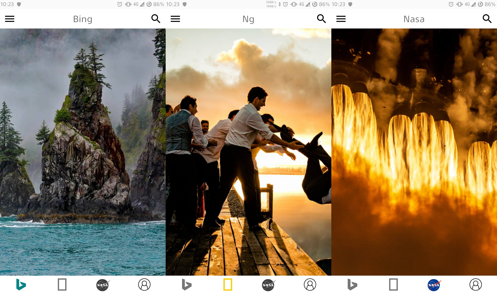
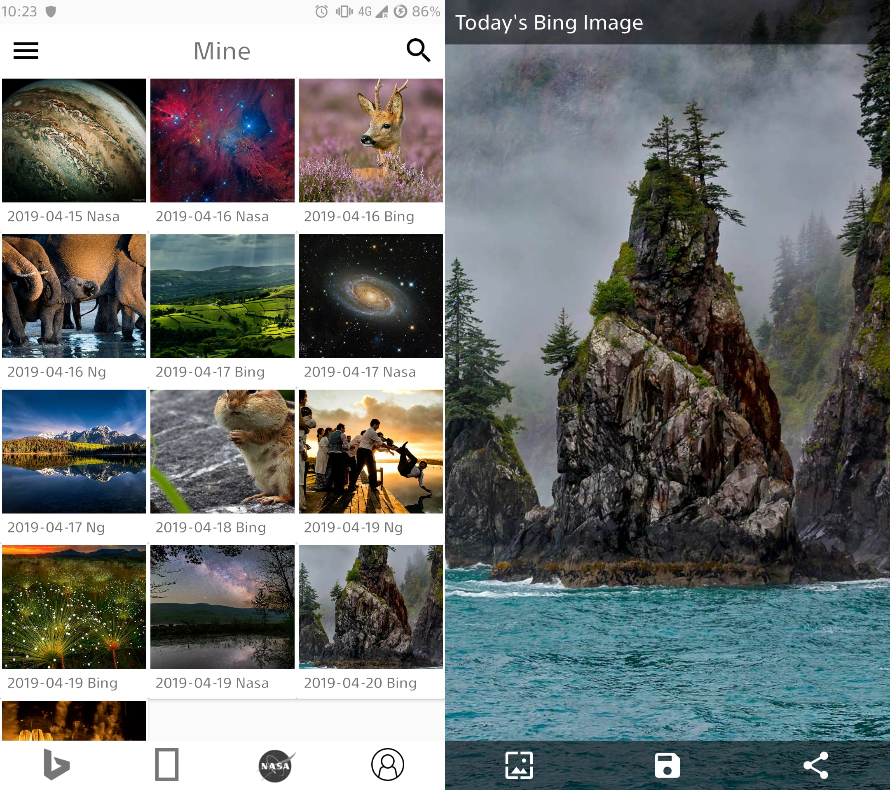
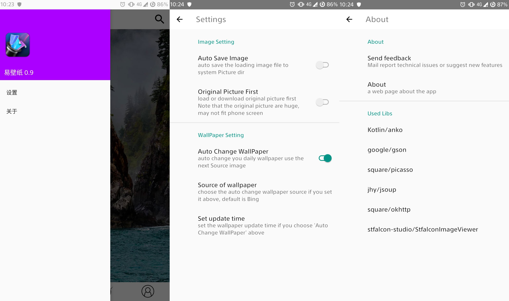

# a WallPaper android application

## Image From

* [Bing](https://www.bing.com/)
* [Ng](https://www.nationalgeographic.com/photography/photo-of-the-day/)
* [Nasa](https://apod.nasa.gov/)

## Functions

* Download image from above site (devices Picture directory)
* Set them as a wallpaper (directly now)
* Share them to other app
* Try auto change your wallpaper (keep the app running needed)
* ~~Search~~ (not implement yet)

## Screenshots

## License

No license XD

